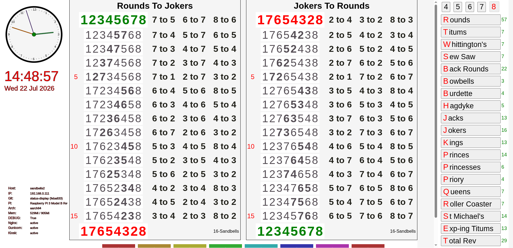

# Sandbells

**Django-based Church Bell Change-Ringing Display & Kiosk**

Sandbells is a web application that computes and displays the step-by-step sequences of **change ringing** (English-style method ringing) between named patterns such as *Rounds*, *Jokers*, *Titums*, *Whittington’s*, *Queens*, etc.

It is designed to run as a **fullscreen kiosk** on a Raspberry Pi attached to an HDMI television or monitor. The interface is intended for simple, mouse-only operation by non-technical users.


*(Full-screen view on Raspberry Pi – clock, dual-direction change sequences, method selector, and live system status)*

---

## What You See on the Screen

- **Analogue + digital clock** and current date (top-left)
- Two side-by-side columns showing the complete transition:
  - Left: e.g. **Rounds → Jokers**
  - Right: the reverse **Jokers → Rounds**
- Each row shows the current order of the bells (e.g. `17654328`) together with the adjacent swaps that produce the next row (e.g. `2 to 4  3 to 2  8 to 3`)
- Right-hand sidebar listing every available method for the selected number of bells (4–8). Clicking a method loads the corresponding change.
- Bottom-left system status panel (hostname, IP, git branch/commit, Pi model, memory, Nginx/Gunicorn/Kiosk service state)

The application supports 4–8 bells and many classic methods (Rounds, Titums, Whittington’s, Sew Saw, Back Rounds, Bowbells, Burdette, Hagdyke, Jacks, Jokers, Kings, Princes, Princesses, Priory, Queens, Roller Coaster, St Michael’s, Exp-ing Titums, Total Rev, …).

---

## Architecture Overview

```
┌─────────────────────────────────────────────────────────┐
│  HDMI Display (TV / Monitor)                            │
│  ┌───────────────────────────────────────────────────┐  │
│  │  Luakit (fullscreen kiosk browser)                │  │
│  │  → http://sandbells.local (or fallback)           │  │
│  └───────────────────────────────────────────────────┘  │
└─────────────────────────────────────────────────────────┘
                          ▲
                          │
┌─────────────────────────────────────────────────────────┐
│  Raspberry Pi (typically Pi 3)                          │
│                                                         │
│  systemd services:                                      │
│  • sandbells-kiosk.service  (starts Luakit on boot)     │
│  • gunicorn.service         (Django app server)         │
│  • nginx                    (static files + reverse     │
│                             proxy)                      │
│                                                         │
│  Django project: changes/                               │
│  └── app: bells/                                        │
│      ├── models.py      (Pattern, Change, ChangeItem…)  │
│      ├── functions.py   (db_process – the core engine)  │
│      ├── views.py       (display, menu, clock, …)       │
│      ├── templates/     (display.html, home.html, …)    │
│      └── static/        (CSS, JS, SVG, audio)           │
└─────────────────────────────────────────────────────────┘
```

### Core Logic
The heart of the system is `bells/functions.py` → `db_process()`.  
Given two patterns of equal length (e.g. `"12345678"` and `"17654328"`), it repeatedly swaps adjacent pairs until the target is reached, recording every intermediate row and the calls (“7 to 5”, “6 to 7”, …). The same process is run in reverse so both directions are shown simultaneously.

---

## Quick Start (Fresh Install on Raspberry Pi)

```bash
# Clone / update
cd ~/Code
git clone https://github.com/wyleu/Sandbells.git   # or git pull
cd Sandbells

# Make scripts executable
chmod +x master_install.sh install-steps/*.sh start-kiosk-solo.sh

# Run the full installer (or --quick)
./master_install.sh

# Reboot – the kiosk should appear automatically on the HDMI screen
sudo reboot
```

After reboot the following services should be active:

| Service              | Purpose                              |
|----------------------|--------------------------------------|
| `sandbells-kiosk`    | Launches Luakit fullscreen           |
| `gunicorn`           | Runs the Django application          |
| `nginx`              | Serves static files + proxies to Gunicorn |

### Useful day-to-day commands

```bash
# Kiosk
systemctl status sandbells-kiosk
sudo systemctl restart sandbells-kiosk
journalctl -u sandbells-kiosk -f

# Web stack
sudo systemctl restart gunicorn nginx
sudo systemctl reload nginx          # after nginx.conf changes

# After code changes
cd ~/Code/Sandbells
source Bellvirtenv/bin/activate
cd changes
python manage.py migrate
python manage.py collectstatic --noinput
sudo systemctl reload gunicorn
```

---

## Project Layout (high level)

```
Sandbells/
├── changes/                     # Django project root
│   ├── bells/                   # Main application
│   │   ├── models.py            # Pattern, Change, ChangeItem, Tower, Bell…
│   │   ├── functions.py         # db_process() – change generation engine
│   │   ├── views.py             # display, menu, clock, portrait, …
│   │   ├── templates/bells/     # display.html, home.html, etc.
│   │   └── static/              # CSS, JS, SVG, audio assets
│   ├── manage.py
│   └── requirements.txt
├── install-steps/               # Numbered installation scripts (01–14)
├── systemd/                     # Service unit files
├── nginx/                       # Production nginx.conf
├── luakit/                      # rc.lua (fullscreen + light config)
├── start-kiosk-solo.sh          # Robust kiosk launcher
├── master_install.sh            # Orchestrates the whole install
├── INSTALL-KIOSK.md             # Detailed kiosk install guide
└── TODO.md                      # Current priorities
```

---

## Current Status (July 2026)

**Working**
- Full kiosk auto-start on boot (Luakit + lightdm)
- Screen blanking defeated (multiple layers)
- Gunicorn + Nginx production stack
- Django venv, migrations, collectstatic
- Dual-direction change display
- Method selector sidebar
- Live system status panel
- Clock (analogue + digital)
- measured layout + iframe scale working on 1920 HDMI
**Still open**
- Run kiosk cleanly as non-root user `sandbells`
- UI/layout polish (the remaining visual piece)
- Dynamic SVG system-info widget
- Log rotation & improved monitoring

See `TODO.md` for the live checklist.

---

## Development Notes

- Default number of bells is 8.
- Patterns are stored as simple strings (`"12345678"`, `"17654328"`, …).
- The `Change` model can pre-compute and store intermediate steps; the live display can also generate them on the fly via `db_process()`.
- MIDI export of any pattern is supported.
- The application includes REST endpoints (`/api/`) for some models.

---

## Licence & Credits

Church-bell change ringing is a centuries-old English tradition.  
This software is a practical tool to help ringers visualise and practise the methods.

Repository: https://github.com/wyleu/Sandbells

---

*Last updated: 22 July 2026*
*Branch / date — main, July 2026
