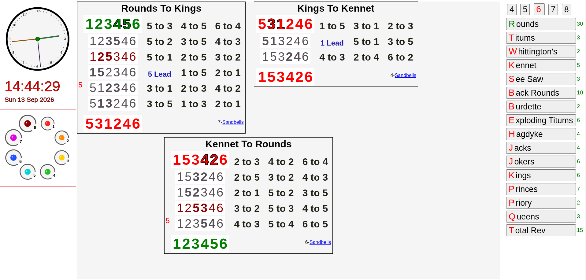

# Sandbells

**Django-based Church Bell Change-Ringing Display and Kiosk**

Sandbells computes and displays the step-by-step sequences of change ringing (English-style method ringing) between named patterns such as Rounds, Kings, Kennet, Titums, Whittington’s, Queens, and many others.

It is designed to run as a fullscreen kiosk on a Raspberry Pi attached to an HDMI television or monitor. The interface is intended for simple, mouse-only operation by non-technical users.



*(Kiosk front page on six bells: clock and circle of bells, three directed legs in a cycle, method list on the right. Example path Rounds → Kings → Kennet → Rounds.)*

---

## What you see on the screen

- Analogue clock, digital time, and date (top-left)
- Circle of bells with per-bell colours (left)
- **Three directed pattern windows** by default, laid out around a cycle:
  - first named pattern → second
  - second → third
  - third → first (often back to Rounds)
- Each window title is the leg name (for example `Rounds To Kings`)
- Each row is the current order of the bells plus the adjacent swaps that produce the next row (`5 to 3`, `4 to 5`, …)
- Start and end rows of a window are emphasised (green / red); named methods that appear mid-path are highlighted
- Right-hand sidebar: bell-count chips (4–8) and the enabled methods for the current number
- System status is still available (clock column / overlay):
  - **Browser** — screen / body / iframe sizes
  - **Network** — WiFi (and SSID), wired, IP addresses, recovery fallback
  - **Server** — hostname (`.local`), git branch/hash, Nginx / Gunicorn / Kiosk
  - **Hardware** — Pi model, arch, memory, temperature, fan percent
  - **Time** — chrony source / lock (`10.42.0.1`, `sandmon.local`, `sandgps*`, or NO LOCK)

Two-window there-and-back display is still supported when `display.random_windows` is `2`.

Tower deployment is intended to work with or without Internet: local WiFi (for example the Sandbells AP on sandmon) and/or Ethernet, with GPS-backed time from a local server.

---

## Architecture overview

HDMI display runs Luakit fullscreen against http://localhost (with fallbacks in `start-kiosk-solo.sh`).

On the Pi (kiosk host such as `sandbells` or `sandbells2`):

- **sandbells-kiosk.service** — Luakit after LightDM
- **gunicorn** / **nginx** — Django and static files
- **sandbells-fan.service** — PWM fan; duty file under `/run`
- **sandbells-time-select** — chrony sources from `settings.json` `time_hosts`
- **sandbells-network-select.timer** — local net check and WiFi SSID fallback list
- **sandbells-early-status** — optional console status before LightDM (install step 16)

Config file: **/etc/sandbells/settings.json**

Django project: **changes/** with app **bells/**.

Optional tower infrastructure (separate repository):

- **sandmon.local** — WiFi AP (SSID Sandbells) and GPS/PPS chrony stratum 1
- https://github.com/wyleu/Sandmon

### Core logic

The engine is still `bells/functions.py` → `db_process()`. Given two patterns of equal length, it repeatedly swaps adjacent pairs until the target is reached, recording every intermediate row and the calls.

Display composition is no longer “always run the same pair forwards and backwards”:

- `bells/legs.py` — one directed leg (`from` → `to`), including the special case that a named **Rounds** start/end uses the prescribed rounds for that digit set
- `bells/demuck.py` — turns raw `db_process` output into row dicts the templates can render
- `bells/compose.py` — builds one, two, or three legs and the shared menu payload
- `bells/app_settings.py` — reads the `display` block from `settings.json`

`random_display` picks a seed (default **Rounds**) plus one or two other enabled methods on the same number of bells, then composes:

- 3 windows: seed → A, A → B, B → seed
- 2 windows: seed → A, A → seed

Layout helpers (`pattern_layout.js`, `pagesize.js`) can shrink stacks under a short column so three windows fit on a kiosk screen. Reloading the same bell-count keeps the current number rather than jumping back to a default.

Other current pages: `/swing/<n>/` (animated circle), `/farm/status/` (multi-device farm), `/layout-test/<n>/<a>/<b>/<c>/` (fixed three-pattern path for layout work).

---

## Configuration

Path: **/etc/sandbells/settings.json**

Created from `install-steps/settings.example.json` on first install. Typical content:

```json
{
  "networks": [
    { "ssid": "Sandbells", "psk": "CHANGE_ME" },
    { "ssid": "sandbells", "psk": "CHANGE_ME" }
  ],
  "time_hosts": [
    "10.42.0.1",
    "sandmon.local",
    "sandgps.local",
    "sandgps1.local",
    "sandgps2.local",
    "sandgps3.local"
  ],
  "clients": {
    "kiosk_ws": "ws://192.168.0.198/ws"
  },
  "ethernet": {
    "dhcp_timeout_sec": 15,
    "fallback_ip": "192.168.99.2",
    "fallback_prefix": 24
  },
  "status": {
    "poll_hint_sec": 3
  },
  "display": {
    "random_bells": 6,
    "random_windows": 3,
    "pattern_position_mode": "centre"
  }
}
```

- **networks** — SSIDs used by network-select / WiFi setup
- **time_hosts** — ordered list for chrony (first entry is preferred when sources are written)
- **clients.kiosk_ws** — optional websocket used by the live tick / kiosk helpers
- **ethernet** — static recovery when DHCP fails on the tower cable
- **display.random_bells** — default number of bells for the random front page
- **display.random_windows** — `3` (cycle of three methods) or `2` (there and back)
- **display.pattern_position_mode** — `centre`, `shorter`, or `float` (how stacks sit in a column)

Do not commit real WiFi passwords; keep secrets only on the machine.

---

## Local network and time

- No Internet is required in the tower if sandmon (or another GPS time host) is reachable on the LAN or AP.
- **Time:** `sandbells-time-select.sh` reads `time_hosts`, writes `/etc/chrony/sources.d/sandbells.sources`, and restarts chrony with a timeout. The systemd unit is ordered `After=chrony` (never `Before=chrony`) so boot cannot deadlock. A wrong system clock will also break HTTPS to GitHub (`server verification failed: certificate error`).
- **Network:** `sandbells-network-select.sh` checks local reachability; if down, tries configured SSIDs. Driven by a timer; also runnable by hand as: `sudo sandbells-network-select.sh`
- **AP and GPS time:** Sandmon provides SSID Sandbells, AP address `10.42.0.1`, hostname `sandmon.local`, and chrony stratum 1 from GPS/PPS.
- Install pattern: a numbered step installs the helper into `/usr/local/sbin` and the unit file from the repo **systemd/** directory only.

---

## Quick start (fresh install)

```bash
cd ~/Code
git clone https://github.com/wyleu/Sandbells.git
cd Sandbells

chmod +x master_install.sh install-steps/[0-9][0-9]-*.sh start-kiosk-solo.sh

./master_install.sh
# or: ./master_install.sh --quick

# Then set real SSIDs/passwords, time_hosts, and display options if needed:
# sudo nano /etc/sandbells/settings.json

sudo reboot
```

After reboot the kiosk should appear on the HDMI screen.

### Services after a successful install

- **sandbells-kiosk** — Luakit fullscreen (enabled at install; starts on boot after LightDM)
- **gunicorn** / **nginx** — Django app and static files
- **sandbells-fan** — PWM fan
- **sandbells-time-select** — ensure chrony sources from `time_hosts`
- **sandbells-network-select.timer** — local net and WiFi fallback
- **sandbells-early-status** — optional pre-LightDM console status (step 16)

### Day-to-day commands

```bash
systemctl status sandbells-kiosk
sudo systemctl restart sandbells-kiosk
journalctl -u sandbells-kiosk -f

sudo systemctl restart gunicorn nginx

cd ~/Code/Sandbells
source Bellvirtenv/bin/activate
cd changes
python manage.py migrate
python manage.py collectstatic --noinput
sudo systemctl reload gunicorn

curl -s http://localhost/api/system-status/ | python3 -m json.tool

sudo sandbells-time-select.sh
chronyc sources -v
sudo sandbells-network-select.sh

systemctl status sandbells-fan
cat /run/sandbells-fan.pct
```

`sandbells_reset.sh` in the repo root is a helper for putting a machine back to a known kiosk state after messy experiments.

---

## Systemd layout

- **systemd/** in this repository is the only place unit files are maintained.
- **install-steps** copy those units into `/etc/systemd/system` and enable them. Prefer `install -m 644` from the repo path.
- Do not rely on long-term hand edits under `/etc/systemd/system`.

Kiosk unit: `After=lightdm.service` and `WantedBy=graphical.target`. Do not use `After=graphical.target` on the kiosk unit (that deadlocks with `WantedBy=graphical.target`).

Time-select unit: `After=chrony.service` and `TimeoutStartSec=60`. Do not use `Before=chrony` while the script restarts chrony.

Install step 14 installs and enables the kiosk service; it does not start it during the install. The unit starts on the next reboot, or with:

```bash
sudo systemctl start sandbells-kiosk
```

---

## Project layout

```
Sandbells/
├── changes/                 # Django project
│   └── bells/
│       ├── functions.py     # db_process engine
│       ├── legs.py          # one directed from→to window
│       ├── compose.py       # 2- or 3-window payload
│       ├── demuck.py        # row shaping for templates
│       ├── app_settings.py  # display block from settings.json
│       ├── views.py / urls.py
│       ├── status_views.py
│       ├── templates/bells/ # display, swing, farm_status, …
│       └── static/          # pattern_layout.js, tick-ws.js, …
├── fan/
├── install-steps/           # numbered NN-*.sh steps and runtime helpers
│   ├── settings.example.json
│   └── sandbells-common.sh
├── systemd/                 # all unit files (source of truth)
├── nginx/
├── luakit/
├── docs/                    # screenshots used by this README
├── start-kiosk-solo.sh
├── sandbells_reset.sh
├── master_install.sh
├── INSTALL-KIOSK.md
├── TODO.md
└── README.md
```

`master_install.sh` runs every `install-steps/[0-9][0-9]-*.sh` in filename order (including `16-early-status` when present).

Useful display URLs (behind the kiosk / nginx root):

- `/random/` or `/random/6/` — random 2- or 3-window path
- `/6/Kings/Rounds/` — explicit pair (legacy two-name URL)
- `/layout-test/6/Rounds/Kings/Kennet/` — fixed three-method path
- `/swing/6/` — circle animation
- `/farm/status/` — farm / multi-Pi status

---

## Recovery Ethernet (no DHCP / tower cable)

When the kiosk has no home LAN and uses the static fallback:

- Kiosk eth0: `192.168.99.2/24`
- Admin laptop USB Ethernet: `192.168.99.1/24`

On the admin machine:

```bash
./sandbells-eth-link.sh
```

Or manually set the USB Ethernet interface to `192.168.99.1/24`, then:

```bash
ping -c 2 192.168.99.2
ssh sandbells@192.168.99.2
```

Use the USB Ethernet interface, not WiFi. Home WiFi (`192.168.0.x`) will not reach `192.168.99.2`.

---

## Current status (September 2026)

Working on `main` (`2734591`, includes `features/three_pattern`):

- Kiosk auto-start after LightDM, blanking defeat, Gunicorn and Nginx
- Three-window (or two-window) directed display, method selector, clock, bell circle
- Display options in `/etc/sandbells/settings.json` (`random_bells`, `random_windows`, `pattern_position_mode`)
- Fan service and duty file
- Network-select timer and helper
- Time-select from settings `time_hosts` (sandmon, `10.42.0.1`, sandgps*)
- Chrony `sources.d` layout; boot-safe time-select and kiosk unit ordering
- Early-status unit (step 16)
- Recovery Ethernet fallback
- Swing page, farm-status page, layout-test URL

Still open:

- Fan curve (quieter ramp)
- UI polish; Luakit/WebKit CPU on smaller Pis
- Log rotation and monitoring
- `feature/network-unify` is on the remote and not yet merged

See `TODO.md` for the live checklist.

---

## Development notes

- Default random display is six bells and three windows (overridable in settings).
- Patterns are stored as simple strings such as `"123456"` / `"12345678"`.
- Intermediate steps are generated live via `db_process()` and shaped by `demuck`.
- MIDI export of patterns is supported.
- REST endpoints under `/api/` include system status and some model APIs.

---

## Licence and credits

Church-bell change ringing is a centuries-old English tradition. This software is a practical tool to help ringers visualise and practise the methods.

- Repository: https://github.com/wyleu/Sandbells
- Tower AP and GPS time: https://github.com/wyleu/Sandmon

Last updated: 13 September 2026 (branch `main`)
